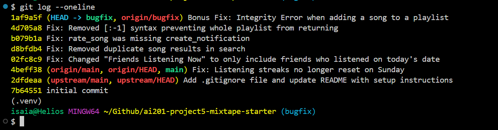

# Project 5 - Mixtape Bug Hunt

---

## AI Usage

### Instance 1

- _What I asked Claude:_ I asked Claude to go over the data model in models.py file and to note out any specific fields that could cause problems in other parts of the app if not set properly.
- _What it helped me learn:_ It helped me understand the connection between the different data types in the app and specifically pointed out some fields that can be problematic like `playlist_entries` having extra fields beyond the foreign keys in its relationship with `songs` so that relationship is not populated automatically.

### Instance 2

- _What I asked Claude:_ I asked Claude to run through the flow of creating a playlist and then adding a song to that playlist.
- _What it helped me learn_: It helped me get a better understanding of the services in the app and how they connect and call each other. One specific interesting point is that even though the `create_playlist` function was in the `playlist_service`, `add_to_playlist` actually came from the `notification_service` instead since adding a song to a playlist sends a notification to whoever shared that song.

## Codebase Map

### Main Directories and Notes

- `models.py` - Defines 5 SQLAlchemy models: User, Song, Playlist, PlaylistSong, and Notification.
  - Association tables
    - `friendships`
      - Modeled with only one row direction, so logic else where must check both directions or both rows are inserted when a friend request is made. (Changed with A.friends returns [B] but B.friends returns []) (Realized friends are just seeded - no actual feature to add a friend)
    - `playlist_entries`
      - Has "position" and "added_by" foreign keys but doesn't get populated by the songs relationship in "Playlist" class.
  - `User`
    - Only returns friends where the user is `user_id`
    - No email validation at the model layer, so should be enforced elsewhere
  - `Song`
    - `album` / `genre` are nullable but `to_dict()` passes None
  - `Rating`
    - `UniqueConstraint(user_id, song_id)` is one rating per user per song, so "update rating" logic would need to be upsert or IntegrityError will be thrown.
    - `score` has no `CheckConstraint` enforcing 1-5 like the comment says. Range is convention but not enforced.
- `./routes`
  - `users.py` - Holds routes related to specific user interactions like getting a user, their streaks, and checking and reading notifications.
  - `songs.py` - Holds routes related to song interactions like searching a song and its details, listening, and rating a track.
  - `playlists.py` - Holds routes related to playlist interactions like creating and viewing a playlist's details getting song count, and adding songs to a playlist.
  - `feed.py` - Holds routes related to the social aspects of the service like seeing who has listened recently and viewing all friends' listening activities.
- `./services` - Has the main functions to complete the interactions specified in the routes.

---

### Sample Data Flow Trace

Here is a the data flow for creating a playlist and adding a song to that playlist:

1. `POST /` routes/playlists.py:create
   - Takes a JSON body `{name, created_by, is_collaborative}` from request and calls `create_playlist(name, created_by, is_collaborative)` in `services/playlist_service.py`
2. `create_playlist(name: str, created_by_user_id: str, is_collaborative: bool = True)` -> Playlist
   - Looks up `User` by id, builds and commits a new Playlist row, return the `Playlist` model instance, and `playlist.todict()` is serialized and returns as JSON
3. `POST /<playlist_id>/songs`
   - Takes a JSON body `{song_id, added_by}`, plus `playlist_id` from the URL and calls `add_to_playlist(playlist_id, song_id, added_by)` (this comes from `notication_service` not `playlist_service`)
4. `add_to_playlist(playlist_id, song_id, added_by_user_id)` -> None
   - Looks up `Song`, `User`, and `Playlist` and if the song isn't in `playlist.songs` is appends it via `playlist.songs.append(song)` and commits. It also calls `create_notification` on the side if the song's original sharer is not the adder. Returns `None`

### Patterns

All routes commit directly to service functions and are organized by what these functions interact with primarily.

---

## Bug Fix 1

### Issue Number and Title

**Issue 1: My listening streak keeps resetting**

### Reproducing the Bug

I ran `pytest tests/test_Streaks.py -v` and looked at the `streak_increments_on_sunday` test which starts a streak on Saturday and tries to update it on Sunday and this test fails. The streak stays at 1 instead of updating to 2.

### Finding Root

I traced the data flow from the `/user` route to the `get_streak()` function in the `streak_service`. From there, I saw it returns `user.listen_streak` so I checked to see where else that field gets updated and saw it was in `update_listening_streak` function. Once I saw this was the only function that actually modifies that field, I knew I was in the right place.

### Root Cause

The actual line that updates the streak by 1, `user.listening_streak += 1` is inside an elif that checks if the last day a user listened was only one day ago AND that the current day of the week is not Sunday, `elif days_since_last == 1 and today.weekday() != 6`. This AND will cause this elif to evaluate to False every Sunday, leading the code to default to the else clause that resets the listening streak to 1, `user.listening_streak = 1`.

### Fix and Side-Effect Check

The fix was to just remove that AND clause from the elif and leave it just as `elif days_since_last == 1`, since the function docstring says nothing about any different functionality or exceptions on Sunday. I checked to make sure streaks still increment on all other days and that it still gets set to 1 for a new user or a skipped day.

---

## Bug Fix 2

### Issue Number and Title

**Issue 2: Friends Listening Now shows people from yesterday**

### Reproducing the Bug

I created a test in `test_feed.py` called `test_friends_listening_now_excludes_yesterday_calendar_day` that checks if a user's friend's last `ListeningEvent` is from the previous calendar date, then that friend should show up in this user's "Friends Listening Now." The test failed, however, and that user's friend does show up.

### Finding Root

I traced the data flow from `feed.py` in routes to the `get_listening_now()` function in `feed_service`. From there, I saw that a `cutoff` field for listening events is set based on the current time - a `RECENT_THRESHOLD` variable, so I knew I was in the right place.

### Root Cause

The `RECENT_THRESHOLD` variable is set to be a time delta of 24 hours, so even if user's friend listened at 9pm yesterday and it is 5pm today, they would still be showing up on that user's "Friends Listening Now."

### Fix and Side-Effect Check

The fix was to replace the `RECENT_THRESHOLD` that used a rolling 24-hour window with a fixed cutoff at the current day's midnight UTC `now.replace(hour=0, minute=0, second=0, microsecond=0`. My full test suite still passes making sure that friends who listened just before midnight are not included but just after are and no duplicate entries show up either.

---

## Bug Fix 3

### Issue Number and Title

**Issue 3: The same song keeps showing up twice in search**

## Reproducing the Bug

I created a test in `test_search.py` called `test_search_no_duplicates_when_song_shared_twice` that performs a `search_song` after two different users share a song with the exact same title and artist and it fails. It returns 2 distinct `Song` rows.

## Finding Root

I traced the data flow from `songs.py` in routes and saw that the `search` function calls `search_songs` with a query. I checked the `search_songs` function in `search_serivces.py` and found where the results for search query are created and knew I was in the right spot.

## Root Cause

There is no dedup step for genuinely distinct rows that happen to represent the same song (both the title and artist match) and nothing in the data model prevents two users from sharing the same song.

### Fix and Side-Effect Check

The fix was to add a dedup section to the `search_songs` function. I did this by creating a set and running a for loop through the results of the query from the database. For any song whose title and artist exactly match what has been added to the set already, then we skip over it and only return one unique entry for each song, even if two users shared the same song. All other tests in `test_search.py` still pass so matching songs still return as expected and nothing affecting songs tags occurred either.

---

## Bug Fix 4

### Issue Number and Title

**Issue 4: I got notified when a friend added my song to a playlist but not when they rated it**

## Reproducing the Bug

I created a test in `test_notifications.py` called `test_rating_a_friends_song_notifies_the_sharer` that has one user share a song to a friend and that friend rates the song. Then the original sharer checks their notifications to see if they have one and it should return one but it returns 0, showing the bug exists.

## Finding Root

I traced the data flow from `users.py` in routes and saw the `get_notifications` function that is defined in the `notification_service`. The actual `get_notifications` function seemed fine for returning notifications so I checked up and saw the `rate_song` function and knew I was in the right spot.

## Root Cause

Unlike the `add_to_playlist` function that has code at the end to explicitly create a notification for the person who shared the song if someone else adds their song to a playlist, the `rate_song` function does not do this. It applies the rating score and just returns the rating so notification is made.

### Fix and Side-Effect Check

The fix was to call the same `create_notification` function as in the `add_to_playlist` function at the end of the `rate_song` function. If the `user_id` of the person rating it doesn't match the person who shared it, then it creates a notification for the person who shared it. I retested the `get_notification` function and made sure notifications for adding to a playlist and rating were still intact, so no regressions.

---

## Bug Fix 5

### Issue Number and Title

**Issue 5: The last song in a playlist never shows up**

## Reproducing the Bug

I used the test in `test_playlist.py` called `test_playlist_returns_all_songs` after seeding a playlist and the test fails because it only returns 4 songs instead of 5.

## Finding Root

I traced the data flow from `playlists.py` in routes and saw the `get_songs` function that calls `get_playlist_songs`. I traced that back to `playlist_service.py` and found the `get_playlist_songs` function that is supposed to return an ordered list of songs in a playlist and knew I was in the right spot.

## Root Cause

The `get_playlist_songs` function returns all songs in a playlist using Python's slicing syntax [start:stop]. Specifically, it omits the start and provides the stop of -1, but Python's slice is inclusive at the start and exclusive at the stop of the index, so the return will not include the last element.

## Fix and Side-Effect Check

The return simply just needs to be `for song in songs` to return all the songs in the playlist. The array indexing is unnecessary. Retesting all the tests in `test_playlists.py` and they pass so no regressions occurred.

---

## Bonus Bug Fix

### Issue Number and Title

**Bonus: Adding a song to a playlist can crash with an IntegrityError**

### Reproducing the Bug

While writing the test for Issue 4, I wrote a sanity-check test for `add_to_playlist` in `test_notifications.py` to confirm the working "added to playlist" notification path still worked. That test crashed instead of failing a normal assertion - it raised a `sqlalchemy.exc.IntegrityError: NOT NULL constraint failed: playlist_entries.position` when calling `add_to_playlist`.

### Finding Root

This connects back to something I noted in the very first codebase map I did with Claude's help: `playlist_entries` has `position` and `added_by` columns that don't get populated by the `songs` relationship on the `Playlist` model. `add_to_playlist` adds a song with `playlist.songs.append(song)`, which only goes through the `secondary=playlist_entries` relationship. That relationship only knows about the `playlist_id`/`song_id` foreign keys, so it inserts a row into `playlist_entries` without setting `position` or `added_by`, both of which are `nullable=False` with no default, so the insert fails.

### Root Cause

`Playlist.songs` in `models.py` is declared as a plain `secondary=playlist_entries` relationship with no mapping for the extra `position`/`added_by` columns on that association table, so appending to it can never populate those columns, and the commit throws an `IntegrityError` the moment `add_to_playlist` is actually exercised.

### Fix and Side-Effect Check

The fix was to stop using `playlist.songs.append(song)` in `add_to_playlist` and instead insert directly into the `playlist_entries` table with all of its columns set, computing the next `position` as `max(position) + 1` for that playlist and setting `added_by` to the user adding the song. I added a regression test, `test_add_to_playlist_populates_position_and_added_by`, that adds a song to a playlist and checks the resulting `playlist_entries` row has the correct `position` and `added_by` values. My full test suite still passes, so the existing notification behavior in `add_to_playlist` is unaffected.

